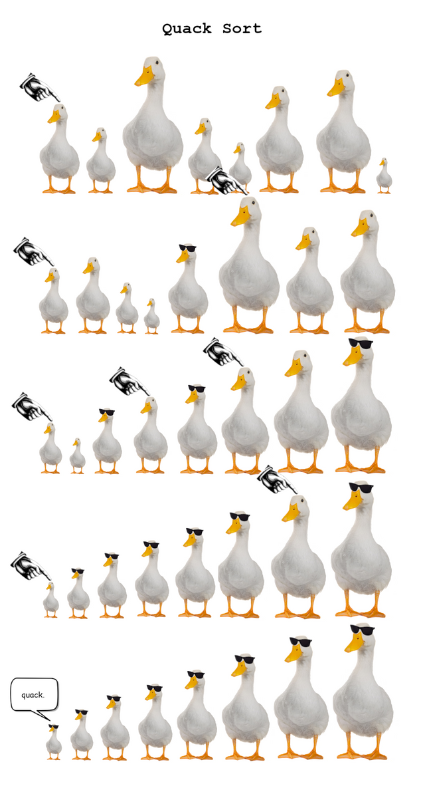
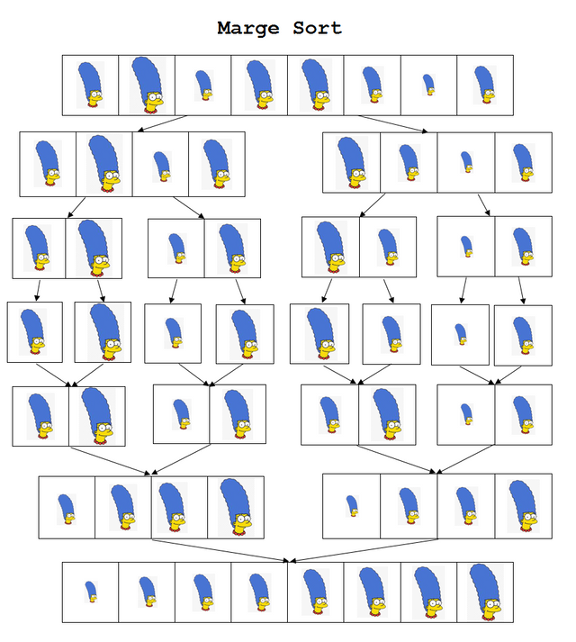

# Sorting

A collection of sorting algorithms done in Python.

## Quack sort

Source: [reddit](https://www.reddit.com/r/ProgrammerHumor/comments/9ysq3j/quack_sort/)

## Marge sort

Source: [reddit](https://www.reddit.com/r/ProgrammerHumor/comments/9yh0rd/marge_sort/)